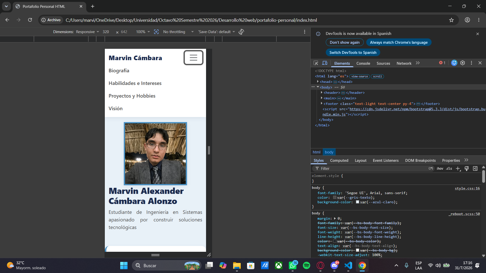
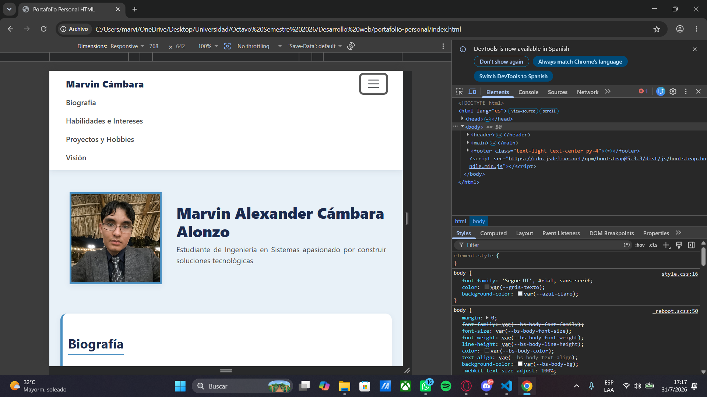
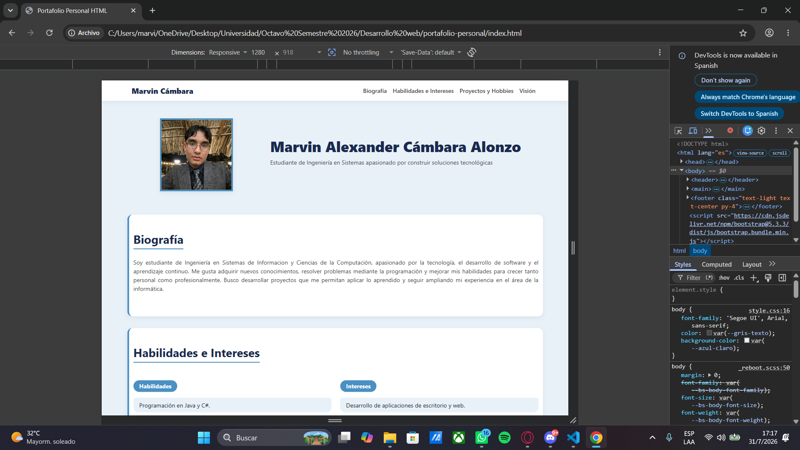

# Portafolio Personal - Marvin Alexander Cámbara Alonzo

## 🎯 Objetivo

Este proyecto consiste en el desarrollo de una página web de presentación personal (portafolio/CV digital), utilizando **Bootstrap 5** como framework CSS, aplicando conceptos de HTML5 semántico, diseño responsive y personalización visual mediante CSS propio. El objetivo académico es aprender a integrar un framework CSS moderno sin perder la identidad visual del sitio.

## 🚀 Cómo ejecutar la página

1. Clona este repositorio o descarga los archivos:
```bash
   git clone https://github.com/MCambara707/portafolio-personal.git
```
2. Abre la carpeta del proyecto.
3. Haz doble clic en `index.html`, o ábrelo con tu navegador de preferencia (Chrome, Edge, Firefox).

No requiere instalación de dependencias ni servidor local: Bootstrap 5 y Bootstrap Icons se cargan mediante CDN, por lo que solo necesitas conexión a internet la primera vez que se carga la página.

## 🧩 Componentes de Bootstrap utilizados

- **Navbar** (`navbar`, `navbar-expand-lg`, `navbar-toggler`, `collapse`): barra de navegación responsive con menú hamburguesa en pantallas pequeñas.
- **Grid System** (`container`, `row`, `col-md-*`): estructura de columnas responsive utilizada en el header (foto + biografía), en la sección de Habilidades/Intereses y en las cards de Proyectos.
- **List Group** (`list-group`, `list-group-item`): utilizado para presentar las habilidades e intereses en formato de lista.
- **Cards** (`card`, `card-img-top`, `card-body`, `card-title`, `card-text`): utilizadas en la sección de Proyectos para mostrar cada proyecto/pasatiempo con imagen, título, descripción y enlace.
- **Botones** (`btn`, `btn-primary`): utilizados como enlaces hacia los repositorios de GitHub de cada proyecto.
- **Bootstrap Icons**: utilizados en el footer para los íconos de redes sociales (GitHub, Instagram) y correo.

## 🎨 Elementos personalizados mediante CSS

Todas las personalizaciones se encuentran en el archivo `style.css`, separado del HTML como lo solicita el proyecto:

- **Variables CSS personalizadas** (`:root`): paleta de colores en tonalidades azules, sombras, radios de borde y transiciones definidas como custom properties reutilizables en todo el sitio.
- **Tipografía**: fuente base `Segoe UI`, jerarquía visual con colores diferenciados para títulos y texto.
- **Sombras y bordes**: cada sección tiene un acento lateral (`border-left`) y sombra suave, dando un efecto de "tarjeta" tipo CV.
- **Animaciones y transiciones**: efectos hover en la navbar (subrayado animado), en la foto de perfil (escala), en las cards de proyectos (elevación y zoom de imagen) y en los ítems de la lista de habilidades (desplazamiento lateral).
- **Texto justificado**: los párrafos largos (biografía, visión profesional, descripciones) usan `text-align: justify` para un aspecto más formal de documento/CV, exceptuando el footer que se mantiene centrado.
- **Responsive personalizado**: ajustes de espaciado (`padding`) diferenciados entre móvil y escritorio en el header, e imagen de perfil con `object-fit: cover` para mantener proporciones sin deformarse en cualquier tamaño de pantalla.

## 🧠 Principales decisiones de diseño

- **Estructura tipo CV**: por solicitud específica de la cátedra, el header combina foto de perfil y biografía en una sola fila (en vez de apilados), simulando el encabezado de un currículum profesional.
- **Paleta de azules**: se eligió una gama de azules (oscuro, principal, medio y claro) para transmitir un ambiente profesional y visualmente suave, evitando contrastes agresivos.
- **Secciones tipo "hoja"**: cada sección del contenido (Biografía, Habilidades, Proyectos, Visión) se presenta como una tarjeta separada con fondo blanco sobre un fondo azul claro general, reforzando la idea de un documento por secciones.
- **Sin uso de `!important`**: se evitó el uso de esta regla siguiendo los requisitos técnicos del proyecto, removiendo clases de Bootstrap que competían en especificidad (como `bg-light`/`bg-dark`) y controlando esos estilos directamente desde `style.css`.
- **Mobile-first responsive**: el uso del sistema Grid de Bootstrap (columnas sin sufijo para móvil, `col-md-*` para pantallas medianas en adelante) permite que el sitio se adapte de forma natural sin necesidad de media queries adicionales complejas.
- **Proyectos y pasatiempo combinados**: las tarjetas de la sección "Proyectos" incluyen dos proyectos académicos reales (BabelScript y DevSolutions) y un pasatiempo personal (videojuegos), cumpliendo con la flexibilidad que permite la consigna ("proyectos o pasatiempos").

## 📱 Diseño responsive verificado

La página fue probada y verificada en los siguientes anchos de pantalla, sin generar desplazamiento horizontal:

### 320px (móvil)


### 768px (tablet)


### 1280px (escritorio)


## 🛠️ Tecnologías utilizadas

- HTML5 semántico
- CSS3 (variables personalizadas, Flexbox implícito vía Bootstrap, transiciones)
- Bootstrap 5.3.3 (CDN)
- Bootstrap Icons 1.13.1 (CDN)

## 👤 Autor

**Marvin Alexander Cámbara Alonzo**
Estudiante de Ingeniería en Sistemas de Información y Ciencias de la Computación